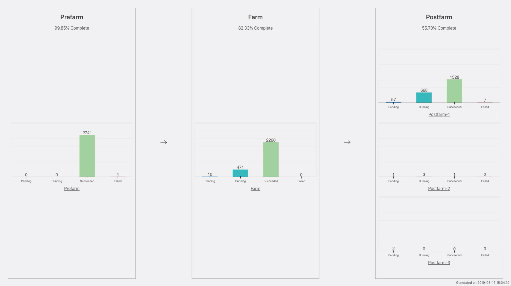

# sdo
Task scheduler for the legacy survey pipeline.
Name stands for [slurm](https://slurm.schedmd.com/) do.

### Requirements
* Python 3
* Qdo

### Usage
* Run init.py
* Run main.py

### A more detailed workflow
0. Obtain access to the qdo database (if you are not sure how to do this, feel free to email decam-chatter).
1. clone qdo, sdo
```
git clone -b ssh-srun https://bitbucket.org/dstn/qdo.git
git clone https://github.com/ziyaointl/sdo
```
2. create a conda environment and install qdo
	1. `conda create -n sdo-dr10 python=3.9`
	2. `conda activate sdo-dr10`
	3. `cd <qdo dir>`
	4. `python3 -m pip install .`
	5. `python3 -m pip install psycopg2 jinja2 bokeh`

At this point, you probably wanto to verify that your qdo is set up correctly by running `qdo list`. If you see a list of queues, congratulations! You are ready to move on to the next step. Otherwise, you may need to double check your database access.

(Optional tip) once you have the above working, the following script can be used as a qdo executable. Though for sdo to work, you'll still need to run `conda activate sdo-dr10`.
```
#!/bin/sh

eval "$(conda shell.bash hook)"
conda activate sdo-dr10

qdo $@
```

3. Create an output folder. A sample layout of which is shown below.


4. Edit settings.py for general settings. Edit stage_instances.py for specifying individual stages. I recommend starting with one stage and add/enable more stages after the first one finishes. This is due to the fact that only the first two jobs in a given user's slurm queue accrue priority, so adding more stages upfront is not very useful.

5. Run
```bash
python3 init.py
python3 main.py
```

6. If you want edit settings.py again, it is recommended to run cleanup.sh and init.py afterwards. Although some options are directly read from the settings file, others are stored in generated scripts, which doesn't auto update when settings.py is changed.
